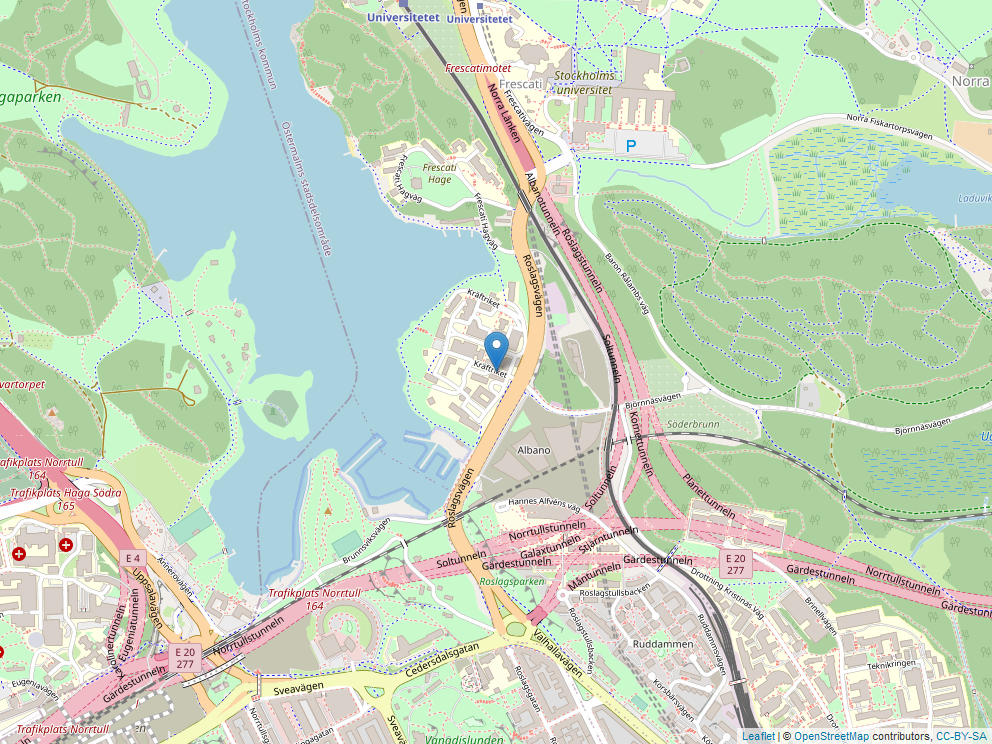

## Instructions
Solutions to the exercises of this homework 3 should, just as for HW1-HW2, be written in an R-Markdown document with output: `github_document`. Both the R-Markdown document (*.Rmd*-file) and the compiled Markdown document (*.md* file), as well as any figures needed for properly rendering the Markdown file on GitHub, should be uploaded to your Homework repository as part of a `HW3` folder. Code should be written clearly in a consistent style, see in particular Hadley Wickham’s [tidyverse style guide](https://style.tidyverse.org/). As an example, code should be easily readable and avoid unnecessary repetition of variable names.

Open the project `hw_data` and pull the most recent changes. If this does not work, delete the folder and clone a new version through an R project.

**Note:** In this homework you will get into contact with SQL databases for the first time. We will spent more time on this topic during next week(s). For now we will only load data of stored databases into R and corresponding code is given in the assignment. If you would like some background on SQL databases you can check out chapter 1, "Relational Databases" of the [Introduction to SQL](https://app.datacamp.com/learn/courses/introduction-to-sql) course on DataCamp.

### Exercise 1: Marketing, conversions and conversion lags
In the file [hw_data/seo_marketing_data.sqlite](https://github.com/MT4007-HT22/hw_data/blob/master/seo_marketing_data.sqlite) we have an example of a database often seen in search engine marketing. It contains data on who buys on that site (conversions). The data has been simplified a lot, but you can imagine it being from a site that rents out rooms for hotels. The database represents customers coming from a search engine (e.g. google), pressing an ad (a “click”) and whether or not they bought something (if a conversion occurred). There are two tables, “Clicks” and “Conversion_value”. Each `id` represent a unique customer. Use the following code snippet to read tables from the database.

```{r, eval=FALSE}
library(RSQLite)
con <- dbConnect(RSQLite::SQLite(), "../hw_data/seo_marketing_data.sqlite")
# List all available tables
dbListTables(con)
# Tables are "Conversion value" and "Clicks"
# Pull all data in a table to R.
df_clicks <- dbReadTable(con, "Clicks")
```

#### Tasks

a) Visualize the number of clicks made on each day (date).

b) Given that there is a cost to each click, which day of the week has been most costly? Hint: there are many ways to solve to problem, but have a look at lubridate::wday.

c) Make a histogram of the conversion value customers provided.

d) The “Conversion lag” (CL) of a customer is the number of days from the customer clicked on an ad to the customer bought something/converted. An example is that the customer clicked an add on the first on January and rented a room on the third of January. The CL is then equal to 2. Plot its distribution in R, interpret and comment on the results. **Hint:** Google on how to take differences of dates. If you want to write a full SQL solution you can use `julianday`.

e) Present **two** tables on the following format
```{r, echo=FALSE}
knitr::kable(rbind(c("Date of click", "CL - 25 days", "CL - 26 days", "CL - 27 days"),
      c("2020-..",	"a number",	"number", "number"),
      c("2020-..",	"a number",	"number", "number"),
      c("2020-..",	"a number",	"number", "number"),
      c("2020-..",	"a number",	"number", "number"),
      c("2020-..",	"a number",	"number", "number")))


```
The two tables should contain the sum of clicks and average conversion value. Display the last five rows with knitr::kable. The tables will be sparse (many zeros). 

**Hint:** Use a suitable function to make the data in wide format.


### Exercise 2: SL lines
The file [HW_data/sl-api.sqlite](https://github.com/MT4007-HT22/hw_data/blob/master/sl-api.sqlite) is a SQLite database containing all SL’s current stops, lines, and the stops on each line. The data are obtained from a call to TrafikLab’s SL [Hållplatser och Linjer 2 API](https://www.trafiklab.se/api/trafiklab-apis/sl/stops-and-lines-2/) on 2019-11-17 using the `httr` package. **Note:** [Trafiklab](https://www.trafiklab.se/api/trafiklab-apis/sl/stops-and-lines-2/) has further documentation of the API and the variables.

#### Tasks

a) List all available tables if the [HW_data/sl-api.sqlite](https://github.com/MT4007-HT22/hw_data/blob/master/sl-api.sqlite) database using similar code as shown in Exercise 1. Figure out and describe how the tables relate to each other. **Note:** Answer the question by both studying the descriptive information on the linked Website and, to a smaller degree, by manually looking at the tables of the database. The latter could, e.g., be useful to confirm what is written in the description. At the end, your answers is supposed to consists purely of text and possibly a figure, but no code.

b) Pull all data from the SQLite database into R. **Important:** The `SiteId`, `StopPointNumber`, `StopAreaNumber`, `JourneyPatternPointNumber` variables in the different data sets are all of the type integer according to the data model, but have not been properly converted as part of the API call. As a consequence, convert them manually to numerical values after importing them into R.

c) Present a table of the number of active unique rail traffic stops (i.e. train, tram or metro stops in each ticket zone (`ZoneShortName` in `stopAreas`/`stopPoints`). By “active” we mean stops that are part of the journey pattern (as defined in `journeyPatterns`) of a line.

d) Choose a line, and plot the stops as points on a map with the name of each stop as a label. Write the code in such a way that it is easily reusable if you want to plot another line. In order to produce a map use the latitude and longitude coordinates and generate the plot using leaflet package. As an example:

```{r, message=FALSE, warning=FALSE}
library(leaflet)

kräftriket <-  data.frame(lon = 18.055, lat = 59.357, name = "Kräftriket")

m <- leaflet(kräftriket) %>% 
    addTiles() %>%  # Add default OpenStreetMap map tiles
    addMarkers(lng=~lon, lat=~lat, popup = ~name) 
m
```

For documents with `output: html_output` or when working with the code in interactive mode you can then just print `m` to see the map. This might, however, not work with `.md` files (i.e. `github_document`)! Instead, you can store the Leaflet input into a file and then read and display this again with `knitr::includegraphics`:

```{r, message=FALSE, warning=FALSE}
#Store leaflet widget as a PNG, see https://stackoverflow.com/questions/31336898/how-to-save-leaflet-in-r-map-as-png-or-jpg-file
library(mapview)
mapshot(m, file = "Leaflet-plot.png")

```

e) Consider the `stopAreas` and `stopPoints` tables and comment on the sparsity of this data presentation, e.g., are there any (unnecessary) redundancies? Suggest a more sparse data model for the `stopAreas` table and perform the appropriate table operations to obtain this sparser representation and store it in the data.frame `stopAreas_sparse`. Explain how one would get the original `stopAreas` data.frame using joins.
Note: A very operational way to check memory consumption for storing a variable in R is to use the `object.size` function.